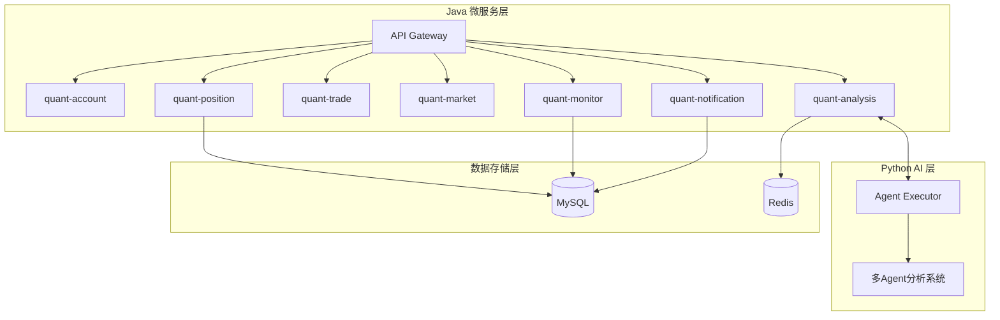

# QuantTrading - 量化交易监控系统

量化交易监控系统是一个基于微服务架构的智能投资研究平台，整合了传统金融数据分析与AI驱动的多Agent股票分析系统。

## 系统架构



## 核心模块

### Java 微服务

| 模块 | 说明 | 端口 |
|------|------|------|
| `quant-account` | 账户管理 | 8081 |
| `quant-position` | 持仓管理、净值计算 | 8082 |
| `quant-trade` | 交易操作 | 8083 |
| `quant-market` | 市场数据 | 8084 |
| `quant-monitor` | 监控规则与事件 | 8085 |
| `quant-notification` | 通知渠道 | 8086 |
| `quant-analysis` | 分析服务 | 8087 |
| `quant-common` | 公共组件 | - |

### Python AI Agent 系统

基于 LangGraph 的多Agent并行分析系统，支持：

- **基本面分析** (FundamentalsAnalyst)
- **市场分析** (MarketAnalyst)
- **新闻分析** (NewsAnalyst)
- **舆情分析** (SentimentAnalyst)
- **多空辩论** (BullResearcher / BearResearcher)
- **交易决策** (Trader)
- **风险评估** (RiskDebator)

## 快速开始

### 环境要求

- Java 17+
- Maven 3.8+
- Python 3.10+
- MySQL 8.0+
- Redis 6.0+

### 后端启动 (Java)

```bash
cd quant-trading-parent
mvn clean install
# 启动单个模块
mvn -pl quant-position spring-boot:run
```

### AI 分析服务启动 (Python)

```bash
cd quant-trading-parent/quant-analysis/executor
pip install -r requirements.txt
python server.py
```

### Docker 部署

```bash
cd quant-trading-parent
docker build -t quant-trading .
docker run -p 8080:8080 quant-trading
```

## 目录结构

```
QuantTrading/
├── quant-trading-parent/           # Java 微服务父项目
│   ├── quant-common/               # 公共组件
│   ├── quant-account/              # 账户模块
│   ├── quant-position/            # 持仓模块
│   ├── quant-trade/                # 交易模块
│   ├── quant-market/               # 市场数据模块
│   ├── quant-monitor/              # 监控模块
│   ├── quant-notification/         # 通知模块
│   └── quant-analysis/             # 分析模块
│       └── executor/               # Python AI 执行器
├── docs/                          # 文档
│   ├── architecture/              # 架构文档
│   ├── development/               # 开发指南
│   └── deployment/                # 部署指南
└── README.md
```

## API 文档

启动服务后访问 Swagger UI：
- quant-position: `http://localhost:8082/swagger-ui.html`
- quant-monitor: `http://localhost:8085/swagger-ui.html`
- quant-notification: `http://localhost:8086/swagger-ui.html`

## 相关文档

- [架构文档](docs/architecture/README.md)
- [开发指南](docs/development/README.md)
- [部署指南](docs/deployment/README.md)

## License

MIT License
