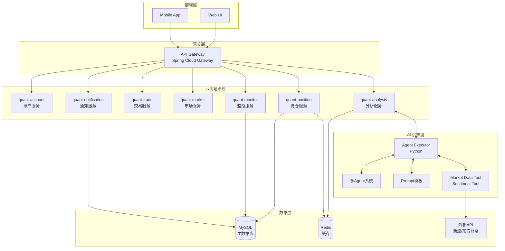
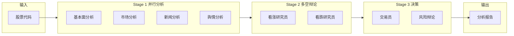
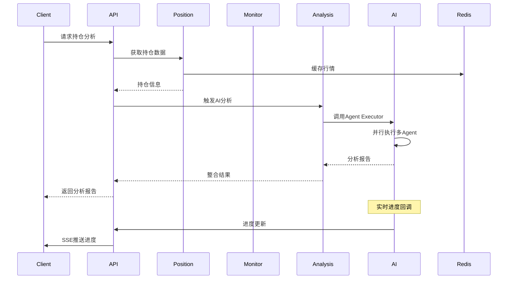

# 架构文档

## 系统架构

### 整体架构



## 模块设计

### quant-common

公共组件模块，提供系统级基础设施：

```
quant-common/
├── exception/          # 全局异常处理
├── result/             # 统一响应格式
├── constants/          # 常量定义
└── util/               # 工具类
```

**核心类**:
- `Result<T>` - 统一API响应包装
- `ResultCode` - 响应码枚举
- `GlobalExceptionHandler` - 全局异常处理器
- `BusinessException` - 业务异常

### quant-position

持仓管理模块，核心业务模块：

```
quant-position/
├── entity/             # 持仓实体
├── repository/         # 数据访问层
├── service/            # 业务服务
│   ├── fund/           # 基金净值服务
│   └── quote/          # 行情服务
├── client/             # 外部API客户端
│   ├── sina/           # 新浪行情
│   └── eastmoney/      # 东方财富
├── scheduler/          # 定时任务
├── dto/                # 数据传输对象
└── controller/         # REST控制器
```

**数据库表**:
- `holding` - 持仓表
- `fund_nav_history` - 基金净值历史
- `etf_price_history` - ETF价格历史

### quant-monitor

监控规则与事件处理：

```
quant-monitor/
├── entity/             # 监控规则/事件实体
├── repository/          # 数据访问层
├── service/            # 业务服务
├── scheduler/          # 定时评估调度器
├── client/             # 通知客户端
└── controller/         # REST控制器
```

### quant-notification

通知服务，支持多渠道：

```
quant-notification/
├── entity/             # 通知渠道/记录实体
├── repository/         # 数据访问层
├── service/            # 业务服务
├── sender/             # 发送器实现
│   ├── NotificationSender  # 发送接口
│   └── ConsoleSender       # 控制台发送器
└── controller/         # REST控制器
```

### quant-analysis

分析服务模块，桥接Java与Python AI引擎：

```
quant-analysis/
├── controller/         # REST控制器
└── executor/           # Python AI执行器
    ├── agent_executor.py   # Agent执行器主类
    ├── agents/             # 各类Agent实现
    ├── prompts/             # Prompt模板
    ├── tools/               # 工具集
    └── server.py            # Flask服务入口
```

## AI Agent 系统架构



### Agent 类型

| Agent | 职责 | 输出 |
|-------|------|------|
| FundamentalsAnalyst | 基本面分析 | fundamentals_report, fundamentals_score |
| MarketAnalyst | 市场走势分析 | market_report, market_score |
| NewsAnalyst | 新闻事件分析 | news_report, news_score |
| SentimentAnalyst | 舆情分析 | sentiment_report, sentiment_score |
| BullResearcher | 看涨观点研究 | bull_argument |
| BearResearcher | 看跌观点研究 | bear_argument |
| Trader | 交易决策 | decision, investment_plan, confidence |
| RiskDebator | 风险评估 | risk_analysis, risk_level |

## 数据流



## 技术选型

| 类别 | 技术 | 版本 |
|------|------|------|
| 语言 | Java | 17 |
| 框架 | Spring Boot | 3.1.8 |
| ORM | MyBatis-Plus | 3.5.5 |
| 数据库 | MySQL | 8.3.0 |
| 缓存 | Redis | 6.0+ |
| 任务调度 | XXL-Job | 2.4.1 |
| API文档 | SpringDoc OpenAPI | 2.5.0 |
| AI框架 | LangGraph | 0.0.20+ |
| LLM | Claude/DeepSeek | - |
| Python | Flask | 3.0.0 |
