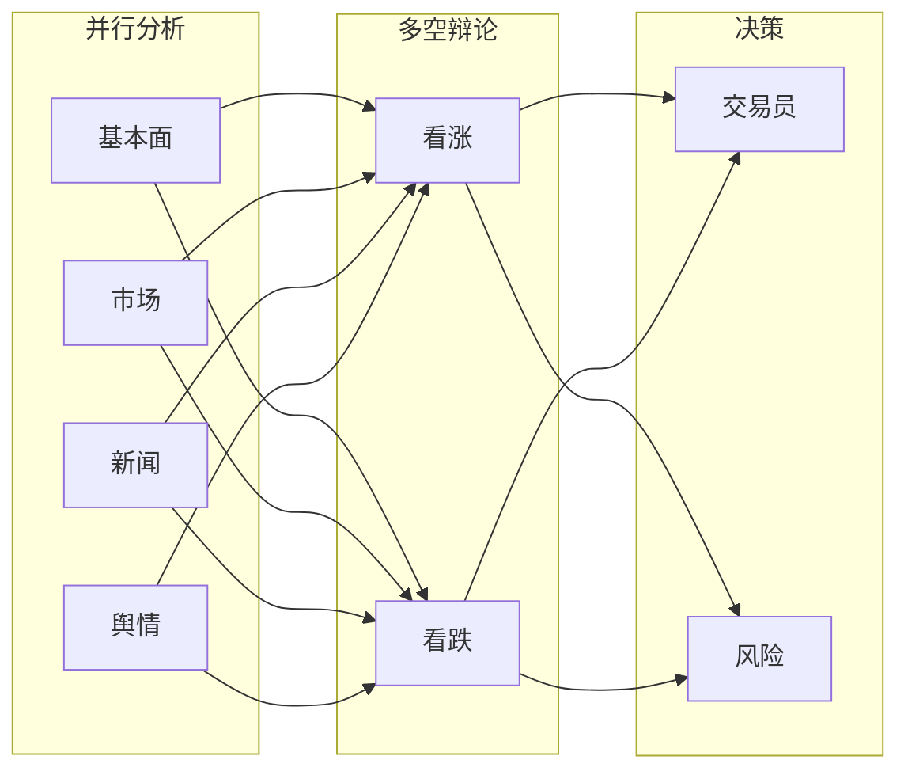

# quant-analysis - 分析服务模块

分析服务模块，桥接 Java 微服务层与 Python AI Agent 引擎。

## 模块职责

- 提供 REST API 触发 AI 分析
- 管理分析任务状态
- 实时进度回调 (SSE)
- 与 Python Executor 通信

## 技术栈

- Spring Boot 3.1.8
- Flask 3.0.0 (Python Executor)
- LangGraph 0.0.20+
- Redis (进度缓存)

## Python Executor

AI 分析引擎位于 `executor/` 目录：

```
executor/
├── agent_executor.py      # 主执行器
├── agents/                # Agent 实现
│   ├── fundamentals_analyst.py
│   ├── market_analyst.py
│   ├── news_analyst.py
│   ├── sentiment_analyst.py
│   ├── bull_researcher.py
│   ├── bear_researcher.py
│   ├── trader.py
│   └── risk_debator.py
├── prompts/              # Prompt 模板
├── tools/                # 工具集
└── server.py             # Flask 入口
```

## Agent 工作流



## 启动

### Python Executor

```bash
cd executor
pip install -r requirements.txt
python server.py
```

### Java 服务

```bash
mvn -pl quant-analysis spring-boot:run
```

服务端口: **8087**

## API

| 方法 | 路径 | 说明 |
|------|------|------|
| POST | /api/analysis/stock | 触发股票分析 |
| GET | /api/analysis/status/{requestId} | 查询分析状态 |
| GET | /api/analysis/result/{requestId} | 获取分析结果 |
